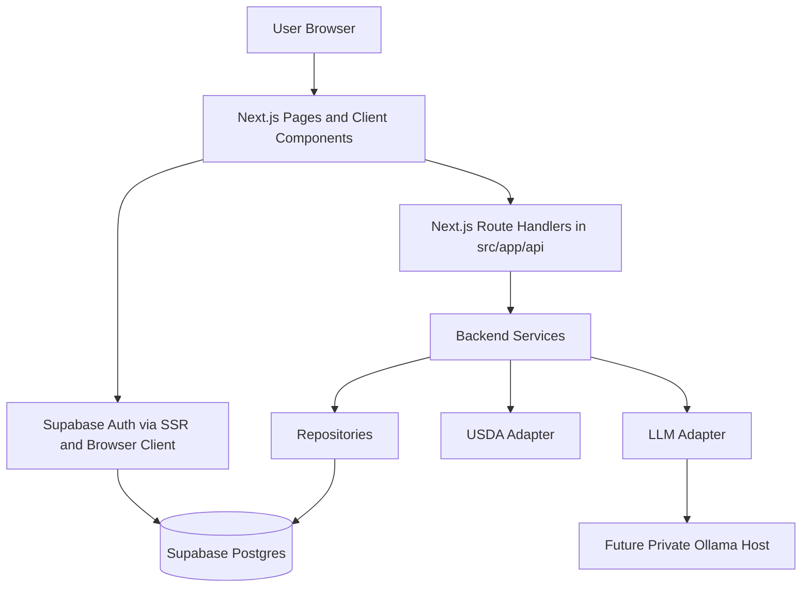
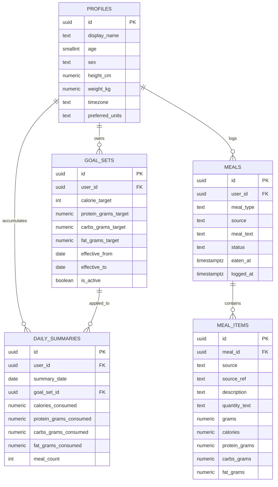
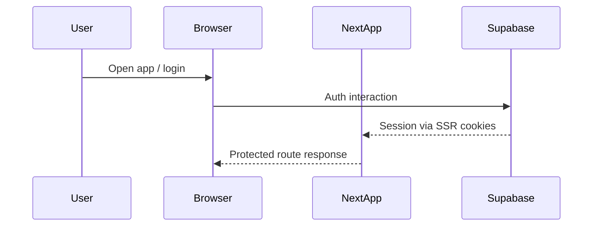
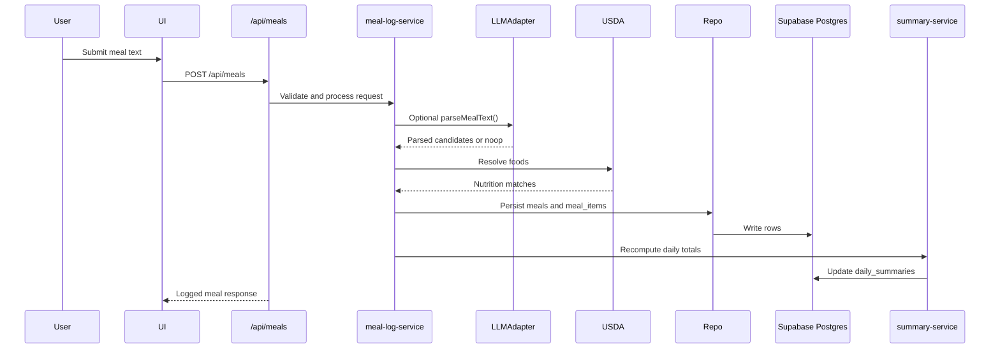
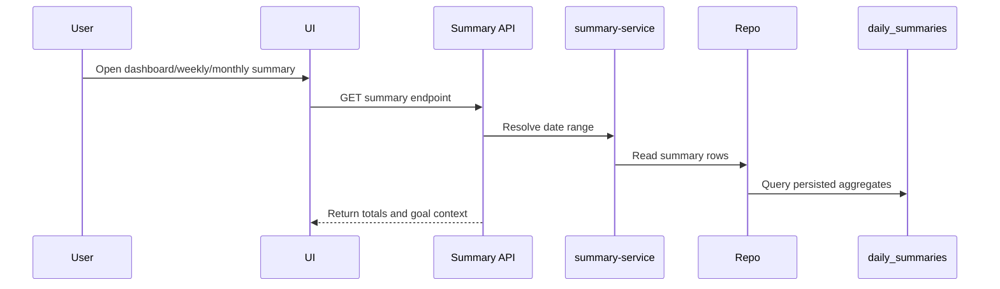
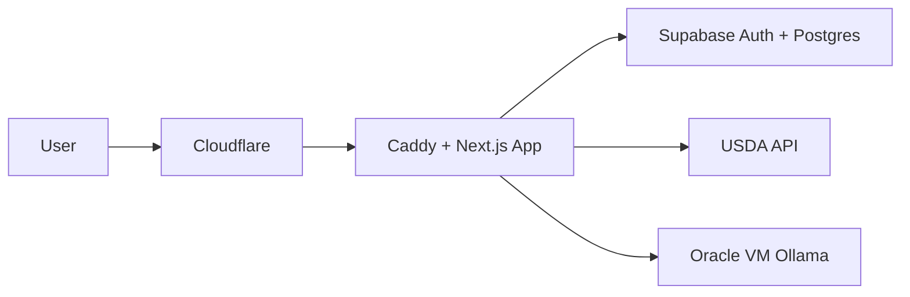

# Project Architecture Map

This file maps the current nutrition app architecture in the repo as it exists today, plus the intended near-term production shape with Supabase and a private Ollama host.

## 1. Current System Summary

- Monorepo managed with `pnpm`
- Primary app is `apps/web`, a Next.js application
- Auth and data layer target Supabase
- Food lookup is handled through a USDA adapter
- LLM parsing is behind an adapter boundary and is currently stubbed/no-op by default
- Shared workspace package exists for reusable contracts and utilities
- The repo is still in a pre-VM phase, but the app structure is already split into frontend, backend, shared config, and tests

## 2. Repo Map

```text
workspace-webdev/
├─ apps/
│  └─ web/
│     ├─ src/
│     │  ├─ app/                 # Next.js routes, layouts, API handlers
│     │  ├─ frontend/            # UI components and browser-facing helpers
│     │  ├─ backend/             # adapters, repositories, services, contracts
│     │  ├─ shared/              # runtime config shared across boundaries
│     │  └─ tests/               # frontend and backend test suites
│     ├─ supabase/
│     │  └─ migrations/          # schema history
│     └─ Dockerfile              # standalone web runtime image
├─ packages/
│  └─ shared/                    # reusable shared package
├─ docs/
│  ├─ architecture/
│  └─ security/
├─ infra/
│  ├─ ci/
│  ├─ docker/
│  └─ k8s/
├─ package.json
├─ pnpm-workspace.yaml
└─ .env.example
```

## 3. Layered Architecture



## 4. Responsibility By Layer

### `apps/web/src/app`

This is the integration boundary.

- Next.js pages and layouts
- route groups for public auth and authenticated app screens
- API route handlers
- auth callback and webhook routes

Current UI routes include:

- `/`
- `/login`
- `/dashboard`
- `/profile`
- `/goals`
- `/meals/new`
- `/summary/weekly`
- `/summary/monthly`

Current API routes include:

- `GET/PUT /api/profile`
- `GET/PUT /api/goals`
- `GET/POST /api/meals`
- `GET /api/summary/daily`
- `GET /api/summary/weekly`
- `GET /api/summary/monthly`

### `apps/web/src/frontend`

Browser-facing UI and helpers.

- auth components
- forms for profile, goals, and meals
- summary range UI
- app navigation
- browser-side Supabase client helper

### `apps/web/src/backend`

Server-side domain and integration logic.

Sub-areas:

- `adapters/`
- `contracts/`
- `lib/`
- `repositories/`
- `services/`
- `validation/`

Key rule:

- business logic should live here, not inside route handlers

### `apps/web/src/shared`

Cross-boundary runtime config.

- environment parsing and validation via `zod`
- public and server config stay env-driven

### `apps/web/src/tests`

Tests are split by the side they protect.

- `src/tests/frontend`
- `src/tests/backend`

## 5. Core Backend Services

### `auth-service`

- resolves the current authenticated user
- supports access control for user-scoped flows
- supports first-login bootstrap patterns

### `profile-service`

- reads and updates profile data
- normalizes and validates profile fields

### `goals-service`

- creates goal set versions
- resolves the active goal set for a date or range

### `meal-log-service`

- receives meal text and timestamps
- uses deterministic parsing and matching flow
- can call the LLM adapter later for structured candidate extraction
- resolves food data through USDA
- writes meals and meal items
- triggers daily summary recomputation

### `summary-service`

- computes day totals from persisted meal items
- reads daily summaries for weekly/monthly rollups
- keeps macro math deterministic

## 6. Integration Adapters

### USDA

Path:

- `apps/web/src/backend/adapters/usda/`

Purpose:

- search and resolve food nutrition data
- provide server-side access to nutrition sources

Current shape:

- `usda-client.ts`
- `types.ts`
- `mock-foods.ts`

### LLM

Path:

- `apps/web/src/backend/adapters/ollama/llm-adapter.ts`

Purpose:

- abstract meal text parsing from the rest of the app
- let the app switch from stubbed parsing to Ollama later without rewriting services

Current state:

- `LLMAdapter` interface exists
- `NoopLLMAdapter` returns no parsed items and warns that parsing is not enabled
- deterministic nutrition math is intentionally kept outside the LLM path

## 7. Persistence Model



## 8. Main Request Flows

### Auth flow



### Meal logging flow



### Summary flow



## 9. Runtime Configuration

Current env contract is validated in `apps/web/src/shared/config/env.ts`.

Required public/runtime inputs:

- `NEXT_PUBLIC_APP_NAME`
- `NEXT_PUBLIC_SITE_URL`
- `NEXT_PUBLIC_SUPABASE_URL`
- `NEXT_PUBLIC_SUPABASE_ANON_KEY`

Optional server-side integrations:

- `SUPABASE_SERVICE_ROLE_KEY`
- `SUPABASE_DB_URL`
- `USDA_API_KEY`
- `OLLAMA_BASE_URL`
- `OLLAMA_MODEL`
- `LLM_PROVIDER`
- `LOG_LEVEL`

Current behavior:

- `LLM_PROVIDER` defaults to `stub`
- `OLLAMA_BASE_URL` defaults to `http://localhost:11434`
- builds remain env-driven so secrets stay out of images and source control

## 10. Infrastructure Shape

### Current

- one deployable Next.js web app in `apps/web`
- standalone build path through `apps/web/Dockerfile`
- Supabase is the planned hosted auth and database layer
- no full production stack is committed yet
- CI workflow is documented but not currently live

### Near-term MVP target



Recommended HTTPS/security path for this target:

- real domain
- Cloudflare proxy/DNS
- Caddy on the app host
- automatic TLS certificates
- Cloudflare SSL mode `Full (strict)`

## 11. Security Boundaries

- user-owned data should remain behind Supabase auth and RLS
- secrets must stay out of Telegram and out of committed files
- route handlers should stay thin and delegate to services
- repositories are the only layer that should speak raw database row shape
- deterministic macro calculation stays outside the LLM path
- public CI should not require live write credentials

## 12. CI And Verification Gates

Current intended blocking checks:

- `corepack pnpm install --frozen-lockfile`
- `corepack pnpm lint`
- `corepack pnpm typecheck`
- `corepack pnpm test`
- `corepack pnpm build`

Side-specific test commands:

- `corepack pnpm test:frontend`
- `corepack pnpm test:backend`

## 13. What Exists vs What Is Planned

### Already real in the repo

- protected auth-aware app shell
- profile and goals persistence paths
- meal logging API flow
- daily, weekly, and monthly summary flows
- Supabase migration files
- Docker path for the web app
- frontend/backend/shared/test structure
- test baseline for services, contracts, and selected API routes

### Still planned or incomplete

- live Supabase environment wiring
- production deployment pipeline
- end-to-end tests
- richer meal review/correction UX
- live Ollama-backed parsing behind the existing adapter
- stronger runtime secret management and ops automation

## 14. Recommended Ownership Split

### Web app

- Next.js UI
- API handlers
- services
- repositories
- auth-aware SSR flow

### Supabase

- auth
- Postgres
- migrations
- RLS and user scoping

### Oracle/Ollama host

- private LLM runtime
- model serving
- future parsing enhancement boundary

### Cloudflare + Caddy

- DNS
- TLS termination chain
- HTTPS enforcement
- public ingress protection

## 15. Bottom Line

This project is architected as a single deployable Next.js app with clean internal boundaries. The important design choice is that UI integration, deterministic nutrition logic, persistence, external food lookup, and future LLM parsing are already separated enough that the app can go live with Supabase first and then attach a private Ollama host without tearing the codebase apart.
